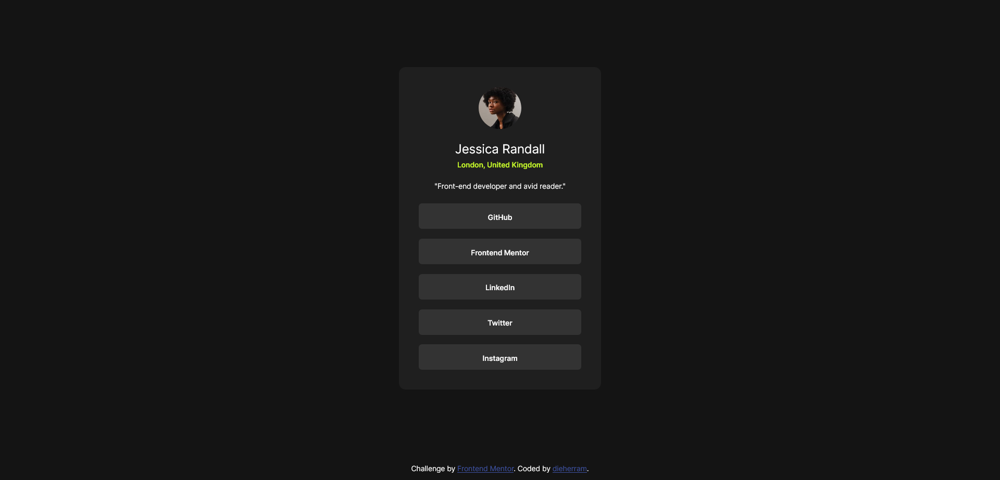
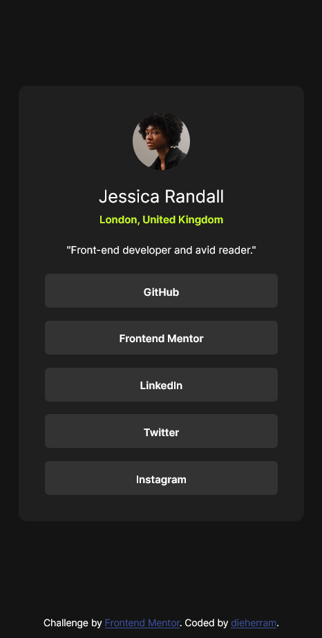

# Frontend Mentor - Solución al perfil de enlaces sociales 🌐

Esta es mi solución al [desafío del perfil de enlaces sociales en Frontend Mentor](https://www.frontendmentor.io/challenges/social-links-profile-UG32l9m6dQ). Los desafíos de Frontend Mentor me ayudan a mejorar mis habilidades de codificación construyendo proyectos realistas. 💪

## Descripción general

### Captura de pantalla 📸

### Enlaces 🔗

- URL de la solución: [GitHub](https://github.com/dieherram/fem-learning-path-03-social-links-profile)
- URL del sitio en vivo: [GitHub Pages](https://dieherram.github.io/fem-learning-path-03-social-links-profile/)

## Mi proceso

### Construido con 🛠️

- Marcado HTML5 semántico
- Propiedades personalizadas de CSS
- Flexbox
- CSS Grid

### Lo que aprendí 📚

En este proyecto, reforcé mi comprensión de varios conceptos clave:

1. **HTML semántico**: Asegurando que el HTML sea significativo y mejore la accesibilidad.
2. **CSS Flexbox**: Utilizando Flexbox para crear un diseño responsivo.
3. **Estilizado de estados**: Implementar estados de hover y focus para elementos interactivos.

### Desarrollo continuo 🚀

En futuros proyectos, quiero seguir mejorando mis habilidades en:

- Técnicas avanzadas de CSS como CSS Grid y animaciones.
- Mejorar las características de accesibilidad en mis proyectos.
- Construir componentes más complejos e interactivos usando JavaScript y frameworks como React.

## Autor ✒️

- GitHub - [dieherram](https://github.com/dieherram)
- Frontend Mentor - [@dieherram](https://www.frontendmentor.io/profile/dieherram)